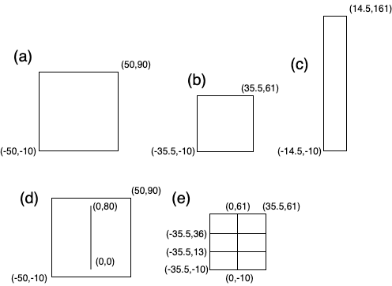
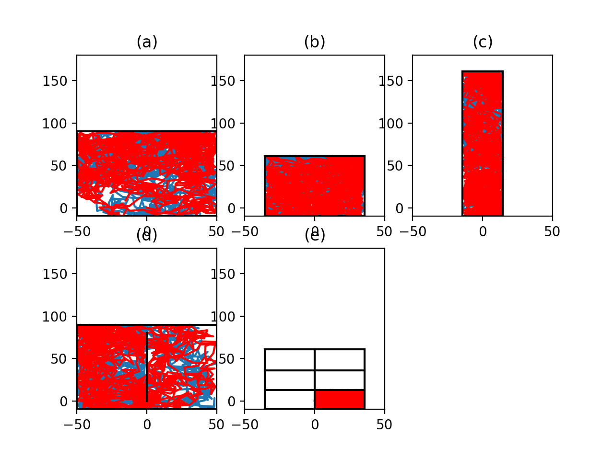

# 人工知能　レポート問題　第８問
## 問題

斥候アリの探索する方法がどのくらい正確かを実験により検証してみる。
適当な領域上をランダムにアリを探索させて、 面積の近似値を求めてみよ。 その値と、実際にアリが採用した巣の実測値を比較して考察せよ。
## 実装方針

`antswalk.py`に実装を記した。

巣穴(a)~(e)を再現するような壁を以下のように(x,y)座標系に定義した。

これらの**(0,1)から到達できる巣穴の部分について**面積などの情報をまとめると以下のようになる。
|巣穴|横の長さ|縦の長さ|面積|周の長さ|
|----|----|----|----|----|
|(a)|100|100|10000|400|
|(b)|71|71|5041|284|
|(c)|29|171|4959|400|
|(d)|100|100|10000|400|
|(e)|35.5|23|816.5|117|

この内部の点(1,0)から歩幅10でランダムウォークを開始し、歩いた距離が$S=L=10000$になるまで行う。もう一度同じランダムウォークを行いつつ、一回めのランダムウォークとの交叉回数$N$を求める。この結果をもとに$K=2SL/\pi N$を求める。
以上を巣穴ごとに100回繰り返し、K値の平均を面積の近似値とした。

### ランダムウォークの細かい実装
以下の(1)~(3)を繰り返すことによってランダムウォークを実現した。

(1)歩幅が10の時、次の地点としてランダムな角度$0<\theta<2\pi$を選び$(x,y)<-(x+10\cos\theta,y+10\sin\theta)$を計算する。

(2)計算した地点に向かう途中に壁にぶつかってしまう場合は、計算した地点を壁に対して対称移動した点に次の地点を設定する。

(3)最終的に移動した距離を残りの距離から引く

(4)残りの距離がなければ終了する、残っていれば(1)に戻る

### 交叉回数のカウント
今回は一回めの経路を中継点の集合として記録しておき、2回目のランダムウォークの際は、一歩進むごとに、一回目の中継点を順番に結んだ際の線分それぞれが進路の線分に交叉しているかどうかをチェックし、交叉回数をカウントした。
## 結果
探索の様子をプロットすると以下のようになる。

きちんと壁の内側を探索できていることがわかる。

`antswalk.py`の実行結果は以下のようになった。

(a) 9785.945225875681

(b) 4963.340802894204

(c) 4799.872577673436

(d) 10445.635847367275

(e) 755.876480465763

理論値と比較すると以下の表のようになる。

|巣穴|理論値|シミュレーション値|誤差(%)|
|----|----|----|----|
|(a)|10000|9785.95|2.14|
|(b)|5041|4963.34|1.54|
|(c)|4959|4799.87|3.21|
|(d)|10000|10445.64|4.46|
|(e)|816.5|755.88|7.42|

概ね巣の大小が正しく測定できていることがわかる。特に、周長が同じ場合((a)と(c))でも面積が半分程度であることを認識できているし、壁がある場合((a)と(d))でも面積は同程度であることを認識できている。