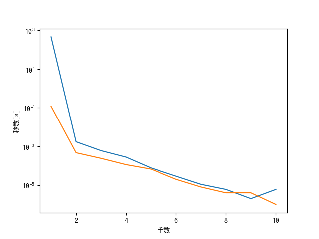

# 人工知能2020 第一回レポート 第4問
## 1.問題定義
[チョンプ](http://www.iba.t.u-tokyo.ac.jp/iba/AI/chomp.pdf)について、
1. 3x5の場合の必勝法を探索によって求める
2. nxnに関して賢いゲーム探索をするAIを作成する。モンテカルロ法や様々な評価関数の木探索の対戦をして勝率を調べる。
## 2.アルゴリズム・ソースコードの説明
今回のソースコードは、教科書の説明を見てC++でオリジナルの実装をした。

## 2.0.コンパイル
以下のようにしてコンパイルする。
```
g++ -std=c++14 <filename>.cpp
./a.out
```
`<filename>`には動かしたいプログラムの名前を指定する。内容は以下のようになっている。
|内容|filename|
| ---- | ---- |
|3x5のチョンプ探索| 35chomp|
|nxnのチョンプ、単純なmin-max探索同士の対戦 | nnchomp_mmvsmm |
|α-βカット付きmin-max法同士の対戦 | nnchomp_abmmvsabmm|
|原始モンテカルロ木探索とα-βカット付きmin-max法による対戦(100回) | nnchonp_mcvsabmm|
|原始モンテカルロ木探索とUCT法探索による対戦(100回) | nnchomp_mcvsUCT|

### 2.1.3x5のチョンプ
`35chomp.cpp`に3x5のチョンプの必勝法を求めるコードを書いた。
実行すると必勝法の最初の手と、最も勝つまでの手数が長い試合(9手)のうち一つが逆順に出てくる。
アルゴリズムとしては、関数`dfs`で深さ優先探索を行い、自分の番の時は子のノードのうち「勝利できる」子ノードがあれば「勝利できる」とし（その子ノードに移動すればいいため）、相手の番の時は子ノード全てが「勝利できる」になっている時は「勝利できる」とすることで、一番最初の自分の手番について「勝利できる」になるものがあるか調べた。これによって自分は勝利できるような手を選べるが、相手はどの手を出すかわからないという条件で探索ができる。
### 2.2.α-βカットによる高速化
`nnchomp_mmvsmm.cpp`に普通のmin-max法、`nnchomp_abmmvsabmm.cpp`にα-βカットつきmin-max法を実装した。min-max法の評価関数はどちらも「勝った時100,負けた時-100」のみの単純なものであり、深さ10まで探索する。それぞれ一回の対戦が行われ、それぞれの手とその手を出すのにかかった探索時間を出力する。今回はこの探索時間が短くなっていることを確認した。
### 2.3.原始モンテカルロ木探索とα-βカットの比較
原始モンテカルロ木探索と先ほどのα-βカットのAIを、先手後手入れ替えそれぞれ100回ずつ対戦させて、モンテカルロ木探索の勝率を調べた。min-max法は深さ5まで、モンテカルロ法のプレイアウトは1000回行う。ソースコードは`nnchomp_mcvsabmm.cpp`である。

### 2.4.原始モンテカルロ木探索とUCT探索の比較
原始モンテカルロ木探索とUCT探索を先手後手入れ替え100回数対戦させ、勝率を調べた。ソースコードは`nnchomp_mcvsUCT`である。
実行時に`./a.out <playout> <c>`のように指定することで、プレイアウト回数とcの値を変更できる。

### 2.5.より良い評価関数の吟味
以上の試行より、α-βカット付きmin-max法の評価関数を改善することがチョンプにおいては最も効果的だと感じたので、評価関数をいくつか用意して試してみた。原始α-βカット付きmin-max法に対して先手後手入れ替え100回ずつ試合を行い、原始評価関数(勝った時と負けた時のみ評価)が勝った回数を算出する。ソースコードは`nnchomp_abmm_hyouka.cpp`である。
実行時に`./a.out <depth>`のように指定することで、探索の深さを変えられる。

### 2.6 より良い評価関数によるα-βカット付きmin-max法の評価
先ほどの実験でより良いとされた評価関数を用いて、原始モンテカルロ法と先手後手入れ替え100回ずつ対戦を行い、勝った回数を記録した。ソースコードは`nnchomp_mcvsabmm`であり、`./a.out 1`と評価関数「1」を指定することによりこの対戦が行える。
## 3.結果と考察
### 3.1.3x5のチョンプについて
実行結果は`ans_35chomp.txt`に出力してある。
実行すると、最初の手が
```
+-+-+-+-+-+
| | | |/|/|
+-+-+-+-+-+
| | | | | |
+-+-+-+-+-+
|*| | | | |
+-+-+-+-+-+
```
であるような必勝法が存在することがわかった。(その後の手は相手の出し方によって異なる)

### 3.2.α-βカットによる高速化
5x5での実行結果は`ans_mmvsmm.txt`と`ans_abmmvsabmm.txt`に出力してある。
まず、α-βカットを行なっている時とそうでない時で出す手は全く変わらないことが確認できる。次に、それぞれの手にかかった時間をグラフにすると、以下のようになる。

特に一番最初の手で、α-βカットを行なっている時に探索時間が大幅に短縮されたことがわかる(461秒から0.12秒)。
これを利用して、alpha-betaカットではより深い探索を行いより強いAIを構築できると考えられる。

### 3.3.原始モンテカルロ木探索とα-βカットの比較
原始モンテカルロの勝率回数(100回中)は以下のようになった。（α-βカットの探索の深さ5、原始モンテカルロ木探索のプレイアウト回数1000回）
|手|N=3|N=5|N=8|N=10|
|----|----|----|----|----|
|先手|69|13|8|10|
|後手|15|19|15|13|

探索木の深さとプレイアウト回数によっても異なるだろうが、今回はalpha-betaカットの方が圧倒的に強くなった。これは、チョンプにおいて相手は極端に不利な手（毒のある部分を噛む）をすることができるため、モンテカルロでランダムに手を選んだ時はその手を相手が選択する場合を考慮してしまうが、実際にはそのようなことが起こらないことが原因だと考えられる。また、原始モンテカルロが先手の時、盤面をN=3から大きくすると、原始モンテカルロの勝率が下がった。可能性のある局面が多いときには、ランダムに選ばれた局面の数が相対的に少なくなってしまい、手の良さを予測するのに十分でなくなるからであると考えられる。

### 3.4.原始モンテカルロ木探索とUCT探索の比較
UCB値のc=0.5,プレイアウト回数はどちらも100回で行なったところ、UCTの勝利回数(100回中)は以下のようになった。
|手|N=3|N=5|N=10|
|----|----|----|----|
|先手|70|50|56|
|後手|40|55|43|
UCTアルゴリズムを用いてもモンテカルロ木探索に比べてあまり改善しなかった。先ほど述べた「チョンプにおいて相手は極端に不利な手（毒のある部分を噛む）をすることができるため、モンテカルロでランダムに手を選んだ時はその手を相手が選択する場合を考慮してしまうが、実際にはそのようなことが起こらない」という欠点を改善できなかったからだと思われる。
### 3.5.より良い評価関数の吟味
N=10,探索の深さは4で実行した。
評価関数を「残りの噛めるところが奇数だったらMY_TURNの時-10,YOUR_TURNの時+10」にしたところ、
```
先手　原始評価関数の勝率 0/100
後手 原始評価関数の勝率 100/100
```
原始的な評価関数によるものより強いとは思えない結果となった。

評価関数を「残りの噛めるところが奇数だったら自分の番の時-(すでに噛んであるブロックの総数),相手の番の時+(すでに噛んであるブロックの総数)を返す。偶数の時、逆」にしたものだと、
```
先手　原始評価関数の勝率 0/100
後手 原始評価関数の勝率 0/100
```
かなり強くなったと思われる。なぜこのような評価関数にしたかというと、最終局面で残りの噛めるところが奇数だと、交互に一個ずつ噛んでいくと負けるというヒューリスティクスによるものである。
### 3.6.より良い評価関数によるα-βカット付きmin-max法の評価
3.3.章と同じ条件(探索の深さ5、プレイアウト回数1000回)で行ったので、3.3.章と結果を見比べてほしい。
原始モンテカルロの勝率は以下となった。
|手番|N=3|N=5|N=8|N=10|
|----|----|----|----|----|
|先手|75|4|0|0|
|後手|0|0|0|0|
明らかに評価関数を変えたことで強くなった。ほぼモンテカルロ法を完封している。

## 4.結論
今回の実験で用いたmin-max法、α-βカット付きmin-max法、原始モンテカルロ、UCT法の中では、評価関数を「残りの噛めるところが奇数だったら自分の番の時-(すでに噛んであるブロックの総数),相手の番の時+(すでに噛んであるブロックの総数)を返す。偶数の時、逆」にしたα-βカット付きmin-max法が最も強かった。
```
g++ -std=c++14 nnchomp_mcvsabmm.cpp
./a.out 1
```
でその強さを確かめてほしい。

## 5.参考文献
「人工知能の方法-ゲームからWWWまで-」　伊庭斉志　コロナ社